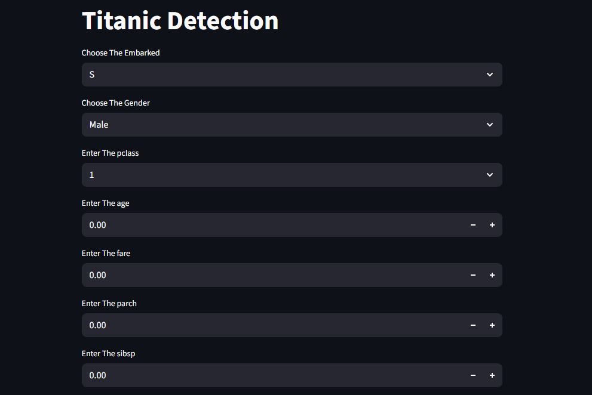
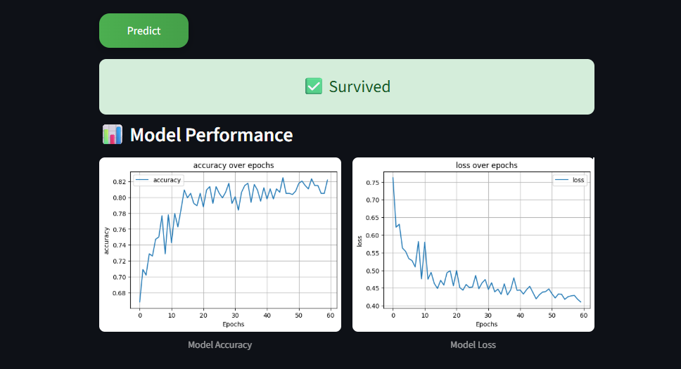
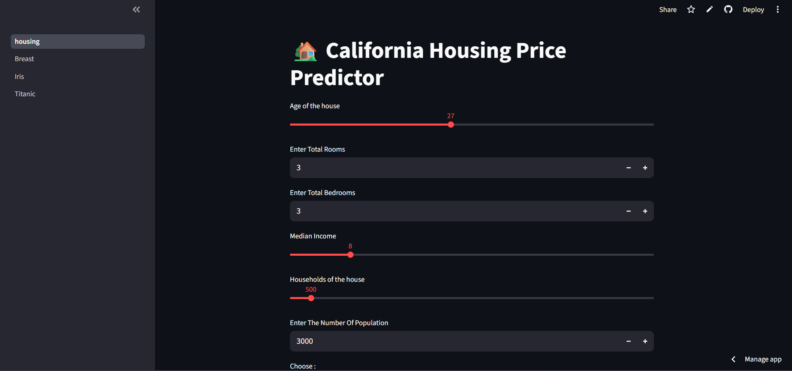
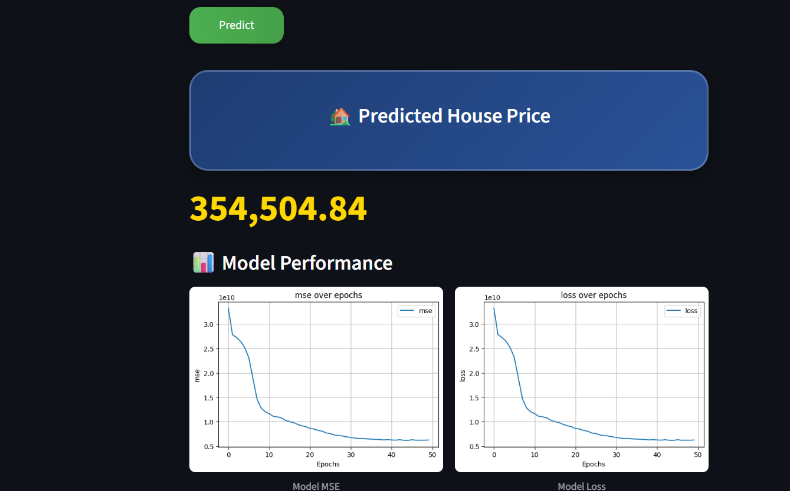
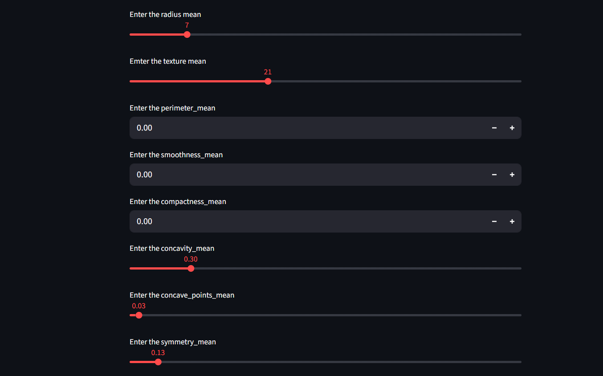
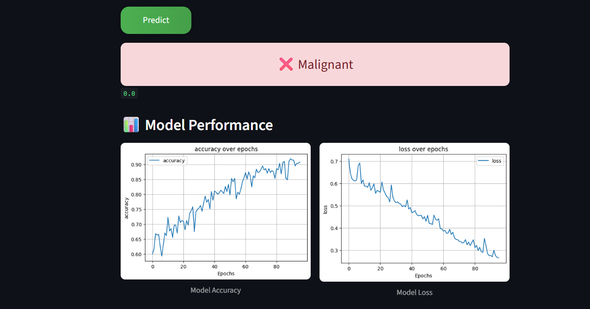
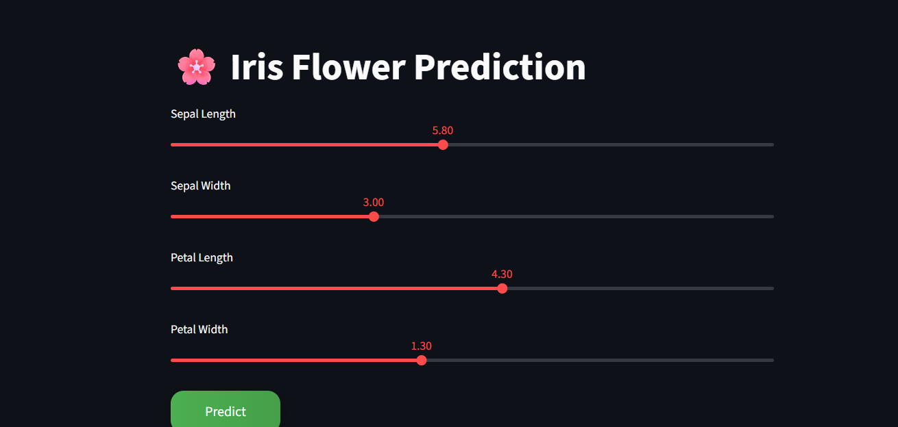
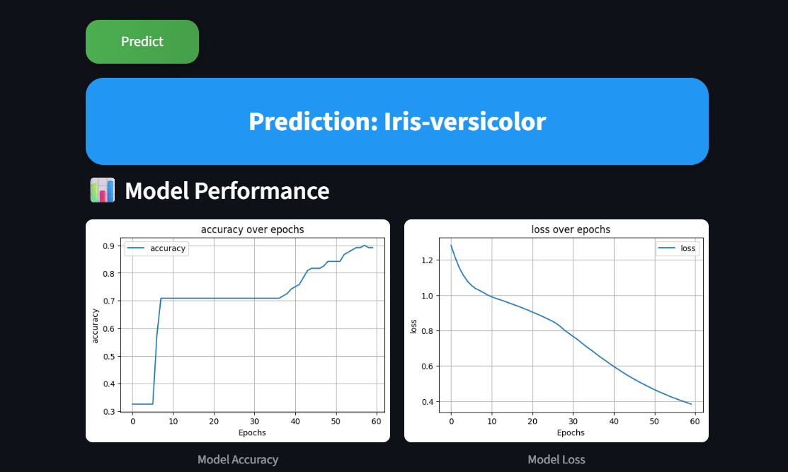
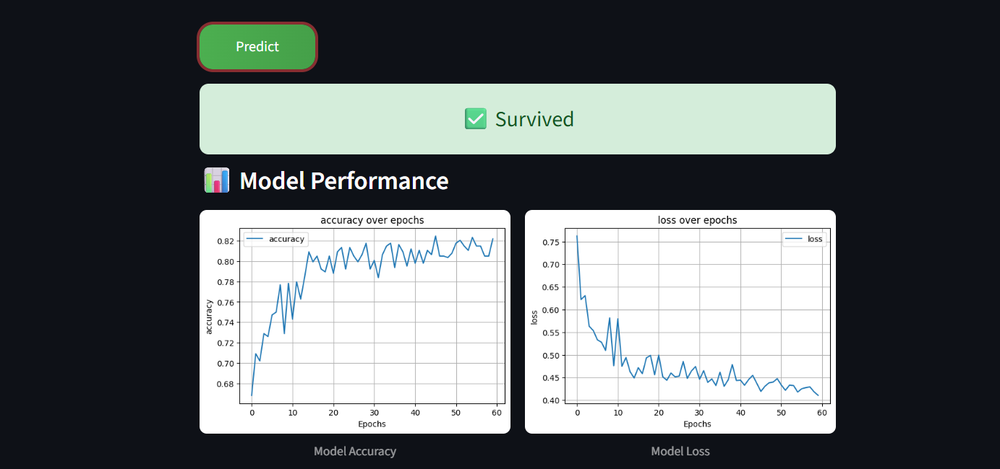

# Deep Learning Project


## Content

This app consists of 4 deep learning detection models:

1. Detect the price of homes in CA
2. Detection of breast cancer
3. Detection of the type of flower
4. Detection of people who survived the Titanic

## Features

- Multiple deep learning models in one place
- Simple and clean web interface built with Streamlit
- Covers real-world problems from medical to financial fields
- Fast predictions with a single click

## How to Run & What I used
- I used scikit-learn , pandas , numpy , notebook, and etc to do the models
- Streamlit to make the simple fron end and backend of this peoject
- Use free hoting like streamlit cloud


--- 
- Enter values of what you want to predict
- Click predict
- Then the prediction appears.

## Motivation

- See the power of DL models and how we can use them in normal life
- Try them in different fields in real life
- So you can see how they handle big problems such as Titanic, medical (cancer), etc


## Installation

- Download the folder of the repo
- Install all the libraries in the requirements.txt file
- Open the terminal and run:

```
streamlit run housing.py
```

## Screenshots



















